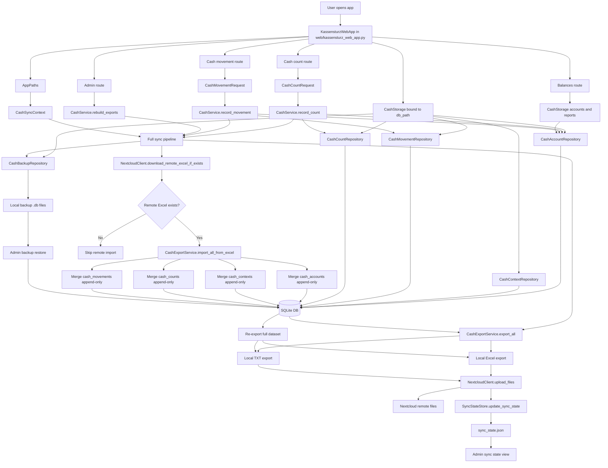

## Data Flow Diagram

## Notes

- Routes create request objects instead of passing many keyword arguments through the app.
- `CashService` owns the business workflow and sync orchestration.
- `CashStorage(db_path)` binds repositories to one database path, while module-level storage functions remain available for compatibility and focused tests.
- `CashSyncContext` carries the runtime paths and config needed by the sync pipeline.
